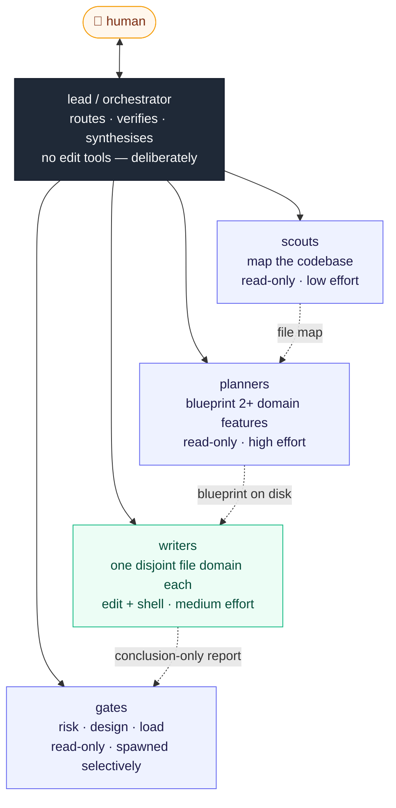
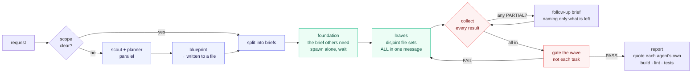

# Building an Agent Team That Is Actually Fast

Practical, **measured** guidance for running a team of AI coding subagents (Claude Code
`.claude/agents/`, or any orchestrator/worker setup with the same shape).

Everything here comes from instrumenting two real production agent teams and reading the
raw session transcripts — not from intuition about what *ought* to be faster. Where a rule
is unproven, it says so. Where a rule was tried and **failed** to move the number, it says
that too.

---

## TL;DR — what changed when the rules below were applied

One team, one codebase, same task type (porting a desktop app to a terminal UI), same
models. **104 subagent runs** measured across three eras.

| Metric | A — no rules | B — rules written | C — rules loaded | A → C |
|---|---:|---:|---:|---|
| **Wall clock per delivered agent** | 18.6 min | 7.4 min | **2.8 min** | **6.6× faster** |
| **Parallel factor** (agents running at once) | 0.53× | 0.68× | **1.51×** | first time above 1.0 |
| Slowest single agent | 43.9 min | 13.9 min | **9.6 min** | −78% |
| Agents taking over 20 min | 7 of 47 (15%) | 0 | **0** | eliminated |
| Conversation turns — p90 | 204 | 100 | **89** | −56% |
| Routine reviewer spawns | 3 | 4 | **1 of 20** | now selective |
| Output tokens — worst agent | 177,085 | 42,039 | 52,138 | −71% |
| Context re-read per agent | 12.34 M tok | 3.86 M tok | 3.87 M tok | −69% |
| **Rework agents** (spawned only to fix a previous agent's output) | 7 of 47 (15%) | 0 | **0** | eliminated |

**Why B and C differ matters more than the numbers.** Era B is *after the rules were written
to disk*; era C is after the session was **restarted**. Agent definitions and hook
configuration are read at process start and **do not hot-reload** — a rule edited mid-session
has no effect at all. Era B proves it: the "no routine reviewer" rule was already in the file,
and the running session spawned four anyway.

Four honest caveats, stated up front:

1. **Median duration barely moved** across every era (4.0 → 4.4 → 4.2 min) while the
   *maximum* collapsed. The rules did not make a typical agent faster — they removed the
   catastrophic tail and let agents overlap. That tail was where the hours went.
2. **Era C's work was more parallelisable by nature** — a scaffold plus seven independent
   screens, versus era A's sequential login and setup flows. Some of the 1.51× is task shape,
   not rules. The evidence that it is *not only* shape: the lead ran the foundation task
   alone, then four leaves concurrently, then three more — the exact pattern §5.3 prescribes.
3. The three eras delivered different feature phases of the same port, so per-agent metrics
   are solid and whole-session totals are indicative.
4. These figures are a snapshot of a session that was still running. Re-running the
   measurement script gives slightly different totals and identical conclusions.

---

## The shape

**Who is on the team.** One lead that never edits, and four kinds of specialist. The two
annotations on each box — its **tool access** and its **reasoning effort** — are the levers
§5.10 and §5.1 are about. Get those wrong and nothing else in this document helps.



**How one phase runs.** The loop that produced the numbers above. Every box that fans out does
so in a *single* message — that is the only thing that actually creates parallelism.



**Proof it works.** A real 20-agent phase, measured. 55 minutes of wall clock, parallel factor
**1.51×**. One foundation, then waves — and one gate per wave rather than one per task.

```mermaid
gantt
    title One phase — foundation, then waves of leaves
    dateFormat HH:mm:ss
    axisFormat %H:%M
    section Foundation
    T0 scaffold              :done, 20:23:40, 20:25:25
    section Wave 1 — one message
    T1 ops/k8s               :active, 20:26:02, 20:33:07
    T2 ops/aws_batch         :active, 20:26:24, 20:33:04
    T3 ops/batch_report      :active, 20:26:42, 20:33:01
    T4 confirm widget        :active, 20:26:58, 20:32:36
    section Gate
    verify wave 1            :crit, 20:33:33, 20:35:21
    section Wave 2 — one message
    T5 screen A              :active, 20:36:03, 20:40:17
    T6 screen B              :active, 20:36:22, 20:40:35
    T7 screen C              :active, 20:36:39, 20:40:06
```



The four leaves in wave 1 finish within **31 seconds of each other**. That is what
correctly-sized sibling briefs look like, and it is the clearest signal that the split
followed real seams in the code rather than an arbitrary line count.

---

## Contents

- [The shape](#the-shape) — team topology, the delegation loop, a measured phase
- [1. Where the time actually goes](#1-where-the-time-actually-goes)
- [2. The measurement method](#2-the-measurement-method)
- [3. Performance results in full](#3-performance-results-in-full)
- [4. Quality results](#4-quality-results)
- [5. The principles](#5-the-principles)
- [6. Runtime mechanics that silently eat finished work](#6-runtime-mechanics-that-silently-eat-finished-work)
- [7. Rules that did *not* work](#7-rules-that-did-not-work)
- [8. Team topology](#8-team-topology)
- [9. Anti-pattern catalogue](#9-anti-pattern-catalogue)
- [10. Audit checklist](#10-audit-checklist)
- [11. What is in this repo](#11-what-is-in-this-repo)
- [12. What published practice adds](#12-what-published-practice-adds) — where external research confirms, extends, and contradicts the above

---

## 1. Where the time actually goes

This is the single most important finding, and it invalidates most intuitive optimisation.

Splitting every subagent's timeline into *waiting for the model to produce tokens* vs
*waiting for a tool to run*:

| | Generating tokens | Running tools | Generation rate |
|---|---:|---:|---:|
| Era A — no rules | **80%** of agent time | 20% | 104 tok/s |
| Era B — rules written | 67% | 33% | 113 tok/s |
| Era C — rules loaded | 69% | 31% | 152 tok/s |

**The build is not your bottleneck. The model talking to itself is.**

Practical consequence — latency is roughly:

```
seconds ≈ output_tokens / 110
```

So every effective rule is about **producing fewer output tokens**, not about running fewer
or faster commands. Two corollaries that follow directly:

- **Reasoning effort is the biggest single lever.** In the measured "before" era, extended
  thinking was ~65% of all tokens the agents generated. Three individual API calls hit the
  64,000-token thinking cap — roughly ten minutes each, for one step. Setting reasoning
  effort *per agent role* (see §5.1) beats every other tuning knob.
- **Each extra tool call costs real time.** Measured: **520–756 output tokens per tool call**,
  which at the rates above is **5–7 seconds each**. A rule that saves input tokens by adding
  tool calls is usually a net loss.

Note the healthy direction of travel in the table: after the rules, the share of time spent
generating *dropped* and the share spent actually running tools *rose*. The agents got more
done per token, which is exactly the intended shape.

---

## 2. The measurement method

Claude Code writes a JSONL transcript per session and one per subagent. Everything above is
derived from those files — no instrumentation, no wrapper, nothing to install.

```
~/.claude/projects/<project-slug>/<session-id>.jsonl          # the lead's transcript
~/.claude/projects/<project-slug>/<session-id>/subagents/
        agent-<id>.jsonl                                       # one per subagent run
        agent-<id>.meta.json                                   # agentType, description
```

`scripts/measure-agent-team.py` in this repo reads that tree and prints the whole table.
Run it against your own sessions:

```bash
python3 scripts/measure-agent-team.py --project <project-slug>
python3 scripts/measure-agent-team.py --project <slug> --split-at 2026-01-15T09:00:00Z
```

The `--split-at` flag produces the before/after comparison: apply a change, then split the
session at the moment you applied it.

Three measurement details that matter, because getting them wrong changes the conclusions:

- **De-duplicate by `message.id`, keeping the maximum `output_tokens`.** Streaming writes
  the same assistant message several times with growing usage; naive summing inflates token
  counts several-fold.
- **Count a re-read as wasteful only within one agent, and only with no intervening edit.**
  Counting duplicate reads across different agents produces a scary ~70% "waste" figure that
  is not waste at all — different agents legitimately need the same file. The honest,
  same-agent, no-edit-in-between number is ~15%.
- **Drop inter-message gaps over ~10 minutes** when splitting generate-time from tool-time,
  or a human reading a report gets counted as model latency.

Full methodology, including the exact JSONL fields: [`docs/measurements.md`](docs/measurements.md).

---

## 3. Performance results in full

**Era A — no discipline rules.** 47 subagents, 14.53 h wall clock.
**Era B — rules written to disk, session not restarted.** 37 subagents, 4.54 h.
**Era C — session restarted, rules actually loaded.** 20 subagents, 0.92 h.

| | Era A | Era B | Era C |
|---|---:|---:|---:|
| Agents | 47 | 37 | 20 |
| Wall clock | 14.53 h | 4.54 h | 0.92 h |
| Parallel factor (sum ÷ wall) | 0.53× | 0.68× | **1.51×** |
| Wall clock per agent | 18.6 min | 7.4 min | **2.8 min** |
| Duration — median | 4.0 min | 4.4 min | 4.2 min |
| Duration — max | 43.9 min | 13.9 min | 9.6 min |
| Agents > 20 min | 7 (15%) | 0 (0%) | 0 (0%) |
| Output tokens — median | 17,387 | 11,850 | 12,433 |
| Output tokens — max | 177,085 | 42,039 | 52,138 |
| Tool calls — median / max | 39 / 174 | 33 / 59 | 31 / 66 |
| Turns — median / p90 / max | 68 / 204 / 307 | 56 / 100 / 118 | 51 / 89 / 109 |
| Cache read per agent | 12.34 M | 3.86 M | 3.87 M |
| Startup context per agent (median) | 27,361 | 37,337 | 37,851 |
| `Read` calls per agent | 18.2 | 9.4 | 10.3 |
| Partial reads (`offset`/`limit`) | 49% | 53% | 49% |
| Output tokens per tool call | 756 | 520 | 597 |
| Routine reviewer spawns | 3 | 4 | 1 |

Three rows carry the story.

**Turns at p90 fell from 204 to 89.** The typical agent was never the problem; a long tail of
agents ran for hundreds of turns, re-reading a growing context on every one.

**Parallel factor crossed 1.0.** Below 1.0 means idle gaps dominate — mostly one agent running
at a time. Era C is the first measurement where agents genuinely overlap, and it is the single
largest contributor to the drop in wall clock per agent.

**Era B changed almost nothing structural.** The rules existed on disk for all of era B and
the running session could not see them. This is the most transferable finding in the table:
*writing the rule is not deploying the rule.*

---

## 4. Quality results

Speed rules are worthless if they trade away correctness. They did not.

| Quality signal | Era A | Era B |
|---|---:|---:|
| **Rework agents** — spawned only to fix a previous agent's output | 7 of 47 (**15%**) | 0 of 29 (**0%**) |
| Agents killed by a turn cap with no report | 0 (cap was far above use) | 0 |
| Test suite after the era's work | passing | **295 tests passing, 0 failed** |
| Linter warnings | — | **0** |
| Files exceeding the size limit | 2 (2,248 and 999 lines) | 0 |

The rework agents in Era A are worth naming, because they are the concrete cost of the
anti-patterns in §9. Every one was avoidable:

```
Fix fabricated example in contract doc      ← agent invented an identifier it never read
Fix wrong API names in shared guide         ← same cause
Correct phase-doc accuracy                  ← same cause
Fix field count in phase doc                ← same cause
Fix startup flow and clipboard fallback     ← reported "done" on an unverified build
Fix sign-in review findings                 ← same cause
Fix a lockfile/gitignore conflict           ← same cause
```

Roughly **1.4 hours** of the measured session went to rework. Four shell commands run
*inside* the original agent (§5.6) would have caught almost all of it.

The measured quality mechanism is simple: **verification must happen inside the agent that
did the work, not in a separate reviewer afterwards.** A reviewer spawned as a routine tail
is a duplicate build that produces no new information; a reviewer spawned *selectively*, for
genuinely high-risk changes, is worth its cost.

---

## 5. The principles

Ordered by measured impact. The first three account for most of the gain.

### 5.1 Set reasoning effort per role, not per session

Extended thinking was ~65% of all generated tokens, and generated tokens are ~80% of wall
time. A single session-wide "think hard" setting therefore taxes every trivial task.

Assign effort by what the role actually decides:

| Effort | Roles | Why |
|---|---|---|
| **high** | architect, requirements analyst, debugger, security auditor | Output is a *decision*; thinking is the product |
| **medium** | implementers, refactorers, design reviewers | Decision is already made; thinking is overhead past a point |
| **low** | doc writers, verifiers, build/release, scouts, task trackers | Mechanical or lookup work |
| **inherit** | the orchestrator/lead | Leave it under the human's control |

Raise an individual agent's effort only when its output quality is *observably* failing, and
record why.

### 5.2 Cap file size, and split along seams that already exist

A file the agents read repeatedly is a recurring tax. One 2,248-line file in the measured
codebase was read **85 times**; at roughly 12 tokens per line that is ~28k tokens per read.

| File type | Hard cap | Start planning the split |
|---|---:|---:|
| Implementation source | **800 lines** | 600 |
| Test-only file | **1000 lines** | 800 |
| Documentation | **500 lines** | 400 |

**But smaller is not monotonically better — the curve is U-shaped**, and this surprises
people. Three measured facts explain why:

- **About half of all reads already used `offset`/`limit`** (49% → 53%). Agents were already
  reading only the region they needed out of big files, so shrinking those files does not
  remove input tokens they were never paying for.
- **Every additional file to open costs 520–756 output tokens — 5–7 seconds.** That is the
  measured price of one tool call. Splitting one concept across three files bills that price
  twice more for every agent that needs the concept.
- **The number of files an agent touches is set by brief scoping, not by file size.** It fell
  from a median of 8 to 5 between eras A and B — during which the *code got split into more,
  smaller files*, which should have pushed it up. What actually moved it was tighter briefs
  (§5.5). Slicing code finer does not reduce what an agent must understand; it fragments the
  same understanding across more round trips.

So the target is **one concern per file** — which in practice lands around 200–600 lines —
and 800 is the *ceiling*, not the goal. Splitting a 750-line file into three 250-line files
adds two round trips for every agent that needs the whole concept and saves nothing.

Split along a seam that already exists (state / rendering / parsing / IO). **If no seam
exists, the file has a design problem — say so instead of cutting it arbitrarily.**

### 5.3 Fan out: one message, many spawns

Parallelism only happens when multiple spawn calls are emitted in a **single** response.
Spawning one, awaiting it, then spawning the next is serial — and it is the default
behaviour unless the lead is explicitly told otherwise.

Sort implementation briefs into two piles before spawning:

| Pile | Test | Action |
|---|---|---|
| **Foundation** | another brief needs its types/functions/module to exist | spawn alone, wait |
| **Leaf** | touches only its own module; consumes the foundation read-only | spawn **all of them in one message** |

Screens, pages, and route handlers are almost always leaves — separate files by
construction. Two measured misses:

- Six documentation tasks with **no overlapping files** were spawned back to back: 20
  minutes that should have been about 7.
- Five implementation agents ran strictly in sequence; the last two touched two different
  screens and shared no file — 12 minutes serial where ~6 would have done.

The trap that causes most missed fan-outs: two leaf briefs both need to add one line to a
shared registry file. **Make that one edit yourself before spawning** — do not serialize two
whole screens because of a single shared line.

Hard constraint: **never fan out two agents that will edit the same file.** Concurrent edits
to one file lose work.

#### What it looks like when it works

The measured timeline is charted at the top of this document under
[The shape](#the-shape) — twenty agents, 55 minutes of wall clock, parallel factor 1.51×.

Wave 1 is the part to copy: four leaves spawned in one message finished in **7 minutes of
wall clock instead of 28**. The shape is the whole rule — **one foundation, then waves of
leaves, with verification per wave rather than per task.**

Two details worth stealing. The four leaves finish within 31 seconds of each other, which is
what correctly-sized sibling briefs look like and a good signal the split followed real seams.
And a single reviewer covers the whole wave: fanning out the work does not mean fanning out
the checking.

### 5.4 Write briefs that remove exploration

A subagent starts with an empty context. Anything the lead already knows and does not pass
on, the subagent pays to rediscover. Every brief carries:

- the **exact file paths** to change (the lead has search tools — use them before delegating),
- the **decision already made**, not the question (if the approach is still open, that is an
  architect task, not an implementer task),
- the **acceptance check** — the command that must pass for this to be done.

This costs input tokens and is worth it. Measured: after briefs got richer, per-agent startup
context rose by ~4.4k tokens **uniformly across every agent type** — including agent types
whose definition files were never touched — while total context re-read per agent fell 69%
and durations collapsed. Paying 4k once to save an agent from exploring is a good trade.

> Watch for this specific misattribution: a uniform startup-context rise across agents whose
> definitions did not change is caused by **longer briefs**, not by bloated agent files.
> Measure per agent type before blaming the wrong thing — an earlier draft of this document
> got that backwards.

### 5.5 One module or one screen per brief

A brief that spans two screens plus configuration plus docs is three briefs. The worst
single run measured took **159 API round trips and 42 minutes**. A brief you cannot state in
three sentences is too big.

### 5.6 Verify exactly once, with the shortest feedback loop you can afford

The rule that matters is **not** "reviewers are bad" and **not** "always self-verify". It is:

> Every change is verified **once**, and the result reaches someone who can still act on it
> cheaply.

Both teams studied satisfy that sentence with opposite architectures, and both are coherent.
Pick one deliberately; the expensive mistake is drifting between them.

#### Design 1 — verification inside the writer

Every code-writing agent runs the project's Definition of Done *before reporting*:

```bash
<build>            # zero warnings
<lint --all>       # zero warnings
<test>
<check that frozen/untouchable paths are still clean>
```

Then **do not add a routine reviewer.** Once writers verify themselves, a review agent
appended to every task is a duplicate build producing no new information — measured cost in
one team: about nine minutes per two development phases, zero findings. Spawn a reviewer only
for an independent second opinion: security-sensitive work, auth or credential paths, or a
task whose own agent reported partial results.

- **Feedback loop:** immediate, inside the agent that still holds the context.
- **Cost:** N builds per turn, one per writer.
- **Fails when:** a writer skips its own checks. Nothing catches it.

#### Design 2 — verification centralised in a read-only gate

Writers do not run the build. Every code-changing turn ends with a **read-only reviewer**
that builds, tests, and checks the domain invariants. A `FAIL` routes back to the owning
writer with the evidence. Add a **fails-twice rule**: if the *same* finding fails twice, stop
and re-plan with an architect rather than thrashing.

- **Feedback loop:** end of turn, after the writer's context is gone.
- **Cost:** one build per turn regardless of writer count, plus a **cold restart** whenever it
  fails — the fix agent reloads the whole file context from scratch.
- **Fails when:** the reviewer becomes a bottleneck, or a failure arrives so late that fixing
  it costs more than the builds it saved.
- **Requires:** a genuinely read-only reviewer (no edit tools) and a written failure loop.
  Without the loop it is not a gate, it is a report nobody actions.

#### Choosing

| | Design 1 (self-verify) | Design 2 (central gate) |
|---|---|---|
| Best when | many small independent changes; cheap build | one expensive build; strong domain invariants a generalist writer cannot judge |
| Marginal cost | N builds per turn | 1 build per turn |
| Failure cost | low — caught in context | high — cold reload to fix |
| Non-negotiable | writers actually run the commands | the reviewer holds **no** edit tool, and `FAIL` has a defined route back |

A useful hybrid: writers run the **cheap** checks themselves (compile, lint, unit tests), and
the central gate owns only what a writer genuinely cannot self-assess — domain correctness,
design fidelity, security, load. That keeps the fast loop fast and reserves the expensive gate
for judgement.

#### Whichever you pick, make the documents agree

In one studied team the "no routine reviewer" rule was written in prose while **five flow
diagrams in the same file still said "spawn reviewer"** — and the diagrams won every time.
*When a rule contradicts a diagram, the diagram wins.* Fix both or fix neither.

### 5.7 Reading and writing discipline

| Rule | Measured reason |
|---|---|
| Search before reading any file over ~400 lines, then read with `offset`/`limit` | whole-file reads of a 2,248-line file, 85 times |
| Never re-read an unchanged file | ~15% of reads were exactly this |
| A *legitimate* re-read is still a **partial** read — after editing, re-read only the region | see §7: the plain "don't re-read" rule alone did not work |
| Never read a file back to verify an edit | the edit tool already fails loudly |
| Edit, never rewrite, an existing file | one agent spent 35k output tokens on edit payloads and 6k on whole-file writes |
| Truncate noisy command output (`… 2>&1 \| tail -40`) | a full build log stays in context for every later turn |
| **Never write an identifier you have not read this session** | 4 of the 7 rework agents existed solely to fix invented names |

That last one is the highest-value rule in the table. Function names, struct fields, config
keys, CLI flags: if it was not read from source in this session, do not write it. Cite
`file:line` in the report for anything non-obvious.

### 5.8 Give agents a soft budget and a mandatory partial report

Roughly **40 tool calls** per delegated task, unenforced — a line the agent is expected to
notice. On reaching it without finishing:

1. Stop adding scope. No "while I'm here".
2. Get the tree compiling. A half-finished change that builds is recoverable; one that does
   not is a net loss.
3. Report **`PARTIAL:`** explicitly — what is done and verified, what is not (as a list the
   next agent can pick up verbatim), and any decision the next agent must not re-litigate.

State plainly in the agent definition that **reporting partial work is a success.** Without
that, agents optimise for appearing complete.

The lead must handle a partial report correctly: do **not** re-delegate the whole task — the
finished part is already on disk. Spawn a follow-up naming only the remaining work, and
surface the partial status to the human. Never round a partial up to "done".

### 5.9 Enforce the return contract with a hook, not with politeness

The lead's context window has to survive the entire goal. A specialist that ends its turn by
pasting a large diff or log dump pins that noise in the lead's context forever.

Asking for "conclusion-only reports" in the agent definition is a *request*. A stop-hook that
inspects the final message and rejects oversized fenced blocks is a *constraint*. See
[`hooks/subagent-return-contract.py`](hooks/subagent-return-contract.py) for a working,
fail-open implementation.

This generalises: **prose rules govern judgement; hooks govern behaviour.** §7 is the
evidence for why the distinction matters.

### 5.10 One owner per file

Assign every file or directory to exactly one agent, written down as a table. Where two
agents could plausibly claim a file, fix the owner and record the reasoning. Watch for
"name twins" — `foo.py` in one service and `foo.js` in another — and state explicitly that
they are never cross-edited.

Note the limit honestly: unless your runtime supports per-agent path permissions, this is
enforced by **delegation discipline, not by a hard access-control list**. The only hard
tool-level guarantee available is withholding edit tools entirely from read-only reviewers.
Do that for every reviewer.

### 5.11 The lead routes; it does not edit

Give the orchestrator no edit or write tools. It reads, routes, verifies and synthesises;
every file change — including documentation — is delegated. This keeps the one long-lived
context window clean and forces the ownership model to be real.

A useful corollary: **do not make the team lead the session default** if the same project
also fields off-topic questions. Routing "what does this env var do?" through delegation
ceremony is pure overhead. Make team mode opt-in at session start.

### 5.12 Keep shared rules in one place

Project-level instruction files are injected into **every** subagent's context
automatically. Repeating the same rules inside each agent definition makes each spawn pay
for them twice.

Verify this for your own runtime before relying on it — in Claude Code, an agent definition
can carry a flag to *omit* the project instructions, and at least one built-in agent sets it.
Check, do not assume. Then: shared rules live in the project instruction file; agent
definitions link to it and add only what is genuinely role-specific.

Expect a modest win. Measured saving from removing the duplication: **~300–560 tokens per
spawn** — real, but an order of magnitude smaller than §5.1–5.3.

#### "One place" means one place per *scope*, not one file for everything

The rule above is about **team-wide** discipline — budgets, reading rules, the Definition of
Done. Those apply to every agent, so they belong in the always-injected file.

**Domain rules are different.** A rule about database migrations is noise in the context of an
agent editing the UI. Pushing every domain convention into the one always-loaded file makes
that file grow without bound, and every agent pays for every domain.

The better shape is a rules directory whose entries are **scoped by file glob** and loaded
only when the work touches matching paths:

```
.claude/
├── CLAUDE.md          team-wide discipline -- always injected, kept short
└── rules/
    ├── <ui-conventions>.md     globs: <your UI source glob>
    ├── <schema-changes>.md     globs: <your migrations glob>
    ├── <endpoint-security>.md  globs: <your route handlers glob>
    └── <one file per domain>
```

One team studied runs fifteen such files. The always-loaded instruction file stays focused on
discipline, and an agent editing a schema migration never loads the UI conventions.

Two failure modes to avoid when you split:

- **Do not split the discipline rules themselves.** They are cross-cutting by definition;
  scoping them means some agent will not receive them.
- **A scoped rule that never matches is a broken reference** (§9.1). Verify each glob actually
  hits files that exist, or the rule is decoration.

### 5.13 Treat documentation drift as a first-class failure

The most sophisticated team studied documents four quality hooks. Reading its actual
configuration, **three exist**; the fourth was documented and never wired, in a file whose
own maintenance section opens: *"Doc drift is the #1 real-world failure of agent teams."*

That is not carelessness — it is the normal end state of any document describing a system
that changes. Defend against it mechanically:

- **Change-propagation ritual.** Any change to a team-wide mechanism triggers a grep for the
  old term across all agent definitions and team docs, and an update pass over every hit, in
  the **same** change set.
- **Intentional deviations need a doc pass too**, with the reason — otherwise the next
  auditor reads them as accidents and "fixes" them back.
- **Config beats docs.** Answer "is X actually enabled?" by reading the configuration file
  and running the hook. Never by trusting the document.
- Re-audit after any burst of agent-file edits, and at minimum monthly.

---

### 5.14 Know what each role costs before you tune anything

Team-level token numbers hide where the money actually goes. Broken down by role across 116
runs and 2.84 M output tokens:

| Role | Runs | Total tokens | Share | Cumulative |
|---|---:|---:|---:|---:|
| **writer** | 58 | 1,983,680 | **69.9%** | 69.9% |
| planner | 8 | 297,197 | 10.5% | 80.3% |
| doc writer | 19 | 258,722 | 9.1% | **89.5%** |
| scout | 12 | 85,817 | 3.0% | 92.5% |
| verifier | 8 | 79,870 | 2.8% | 95.3% |
| *five other roles* | 11 | 133,548 | 4.7% | 100% |

**Three roles are 89.5% of everything.** Tuning the other seven is rounding error. If you only
ever profile one thing, profile your writers.

Cost per invocation differs by more than 5×, and that is the number that should drive routing:

| Role | Tokens per run | Minutes per run | Tool calls per run |
|---|---:|---:|---:|
| planner | 37,149 | 9.2 | 35 |
| writer | 34,183 | 9.5 | 44 |
| doc writer | 13,616 | 3.0 | 26 |
| verifier | 9,983 | 4.0 | 49 |
| **scout** | **7,151** | **1.6** | 19 |

**A scout costs one fifth of a planner.** That single ratio justifies a routing rule that is
easy to skip: **send the cheap scout first, always.** Letting an expensive planner do its own
file discovery burns planner-priced tokens on scout-priced work. Two scouts and one planner
cost less than one planner that had to find everything itself.

The same ratio argues against the opposite mistake — do not route a genuine design decision to
a scout because it is cheap. The cost table tells you what a role is *for*, not that cheap is
better.

#### Tool mix tells you what a role actually does

Declared purpose and observed behaviour diverge more than you would expect:

| Role | Observed tool mix | What it reveals |
|---|---|---|
| writer | Bash 43% · Read 29% · Edit 23% | spends more calls on shell than on editing — build/test loops dominate |
| planner | Read 61% · Grep 32% · Glob 6% | pure comprehension, zero shell. Correct for the role |
| scout | Read 60% · Bash 31% | a "read-only" scout shelling out for a third of its calls |
| verifier | **Bash 73%** · Read 26% | not a reviewer — a build runner |
| design gate | Bash 63% · Read 35% · **Edit 0%** | behaves as read-only despite holding edit tools |

The verifier row is the useful one. A role whose calls are three-quarters shell is not applying
judgement; it is running commands the writer could have run itself. That is the empirical case
behind §5.6 — and you can only see it by measuring the mix.

### 5.15 Audit what tools each agent actually uses

Every tool in an agent's list costs schema tokens in its context on every run, and — more
importantly — a tool an agent holds is a tool it can use. Compare the **declared** tool list
against **observed** usage. Measured across the same 116 runs:

| Agent | Declared | Never used once | Barely used |
|---|---|---|---|
| design gate | Bash, Edit, Glob, Grep, Read, Write | **Write**, Glob, Grep | **Edit — 1 call in 113** |
| verifier | Bash, Glob, Grep, Read | Glob, Grep | — |
| deploy | Bash, Glob, Grep, Read | Glob, Grep | — |
| security | Bash, Glob, Grep, Read | Glob, Grep | — |

Two distinct findings hide in that table.

**The governance one.** Across four runs the design gate made 113 tool calls: 72 shell, 40
reads, and **exactly one edit**. It never touched `Write` at all. In practice it is a read-only
reviewer, but the *one hard, tool-level guarantee* available to you (§5.10) is not being
claimed — and that single edit is precisely why the distinction matters. Remove the tools and
"this agent does not modify files" stops being an observation about the last four runs and
becomes a fact about every future one.

If a role genuinely needs to make the occasional fix, that is a different decision — but make
it deliberately, and stop calling the agent a gate.

**The redundancy one.** Four agents declare `Glob` and never call it; they reach for `Grep` or
`Read` instead. That is a signal the tool list was copied rather than chosen. Prune it — and
note the direction of the risk: a missing tool produces a visible failure the agent works
around, while a surplus tool produces silence.

#### Watch for wrong-case and invented tool names

One verifier run called a tool named `bash` when the tool is `Bash`. One wasted round trip,
no error anyone would notice, and it appears in the transcript only as a tool name that exists
nowhere in the agent's declared list.

This is [§9.1's broken reference](#91-broken-references-deserve-their-own-paragraph) at
runtime rather than in the definition. The check is the same shape and just as cheap: **any
tool name appearing in a transcript that is not in that agent's declared list is a defect** —
either a typo the model made, or a tool it needed and did not have. Both are worth knowing.

## 6. Runtime mechanics that silently eat finished work

These three share a signature: **something works exactly as specified, and it changes
nothing.** No error, no failed build, nothing in a log. They are the most expensive defects in
this document, because the cost is paid in full and the result is discarded.

### 6.1 Turn caps: two valid designs, one fatal mistake

Both teams studied cap how long a subagent may run. They chose **opposite** values, and both
are defensible — because the cap is not a standalone knob. It is half of a system.

First, the mistake. A hard turn cap does not ask the agent to wrap up. It **aborts the run
mid-sentence, and the human gets no report at all** — the work done so far is orphaned on
disk with nothing describing it.

Now the measured turn distribution, across 76 real subagent runs:

| Population | Median turns | p90 | Max | Would exceed a cap of 50 |
|---|---:|---:|---:|---:|
| All agents | 60 | 142 | 307 | **64%** |
| Writers (implementers, doc writers) | 67 | 157 | 307 | 61% |
| Read-only (scouts, reviewers, architects) | 58 | 113 | 166 | 76% |

Note that this holds *after* the discipline rules: even in the improved era, 66% of agents
still ran past 50 turns. Shorter agents are not the same thing as few-turn agents.

### Design 1 — low cap plus a pre-split scoping discipline

Cap writers at ~50 turns, and make it work by **never spawning a task that could exceed it**:

- **Decide from file count at plan time, because turn count is unpredictable.** In that
  team, one complex single file ran 25 turns while a six-file task ran 49. File count is the
  only signal available *before* spawning: **≤4–5 files → one spawn; 6+ files, or one very
  large file, or a whole migration phase → pre-split** into ~4-file chunks.
- **Aim for ~30 turns, not the full 50.** The ~20-turn buffer absorbs the variance.
- **Hand the specialist its exact file list** so its budget goes into editing, not searching.
- **Pre-split with a warm handoff.** Part 1 reports `done: <files migrated> / remaining:
  <files still on the old pattern>` and leaves the tree building; part 2 receives that status
  and continues *warm*. A truncation followed by a cold "finish the job" agent reloads the
  whole context and roughly doubles the cost of that slice. That team measured a single
  over-scoped phase burning ~10M tokens, hitting the cap, then ~8M more to redo the same
  context — **~15–20M tokens avoidable per over-scoped phase**.
- **Mechanical bulk edits become a codemod, not one agent invocation per file.** For an
  identical transform across many call sites, have one specialist write and run a script
  once — zero model turns per file — then hand-edit only the sites that do not fit.
- **Do not simply raise the cap.** An agent running to ~100 turns re-reads its now-huge
  context every turn and loses coherence over a long edit.

The subagent **cannot see its own turn counter**, so it cannot self-rescue before the cap.
The reliable lever is the lead's scoping, never the worker's restraint. That is the whole
reason this design needs the discipline attached.

### Design 2 — high cap plus a soft budget and mandatory partial reports

Set the hard cap as a **runaway backstop only** — comfortably above the worst run ever
observed (measured worst: 167 turns → cap set at 200) — and control length with the soft
budget and `PARTIAL:` protocol from §5.8.

Result in the measured era: **maximum 118 turns, zero agents killed, zero silent
disappearances.**

### Choosing

| | Design 1 (low cap) | Design 2 (high backstop) |
|---|---|---|
| Requires | disciplined pre-split scoping by the lead | disciplined self-reporting by the worker |
| Fails when | the lead over-scopes → silent truncation | the worker keeps going → long expensive runs |
| Best for | large mechanical migrations, many similar files | exploratory feature work, unpredictable scope |
| Cost of failure | high (orphaned work, cold restart) | moderate (one slow agent) |

**The fatal mistake is a low cap with neither discipline.** Applying a 50-turn cap to the
measured team as it actually behaved would have killed **64% of its agents with no report**.
If you set a low cap, you must own the scoping. If you cannot guarantee the scoping, set the
cap high and invest in partial reporting instead.

### 6.2 Spawn mechanics: the report that never arrives

Some runtimes offer two ways to run the *same* agent definition, and they differ in one
respect that decides whether you ever see the result.

| | **Subagent** | **Teammate / persistent agent** |
|---|---|---|
| Analogy | a blocking function call | starting a worker you must collect from |
| On completion | its report **returns automatically** as the tool result | it goes **idle**; nothing is pushed to you |
| Its context | discarded when it finishes | **stays alive** — you can ask follow-up questions |
| If the lead forgets it | impossible | the work sits finished and uncollected, silently |

The trap is not that one is worse. It is that **the choice is often made by accident.** In
Claude Code the mechanism is selected by whether the spawn passes a `name:` argument, under a
feature flag. Measured across 84 spawns in one session, the correlation was exact:

```
teammate + has name    12        subagent + has name     0
teammate + no name      0        subagent + no name     72
```

The lead was passing `name:` for a nicer label in the task list — and silently changing how
the result comes back. 86% of the time the familiar mechanism applied and the report arrived
on its own, which is precisely what makes the other 14% so hard to notice.

**What it cost:** two agents (a scout and an architect) finished successfully with complete
reports of 9,066 and 66,498 characters sitting ready. They went idle. The lead read "idle" as
"still working", kept waiting, filled the time re-reading files the architect had already
mapped, and **produced nothing for 23 minutes** until a human asked why it was quiet.

#### The rules that fix it

1. **Default to the auto-reporting mechanism.** Do not opt into a persistent agent for a
   cosmetic reason. If your runtime keys this off an argument, say so explicitly in the lead's
   instructions — the lead cannot infer it.
2. **`idle` *is* the completion signal.** There is no fuller report arriving later. Waiting
   for one blocks forever.
3. **Collect in the same turn.** On the idle or completion signal, pull the report
   immediately, then keep executing the plan. Never end a turn with "waiting for the report"
   — an ended turn with nothing scheduled may never wake again.
4. **Have a fallback that does not need the tool.** If the collection tool is unavailable or
   returns nothing, verify the world directly: version-control status shows what a writer
   changed, and the agent's own transcript on disk holds its final report as the last
   assistant message. A missing tool is never a reason to stop.
5. **Make the report a completeness check.** Require the lead to list every agent it spawned
   this turn, with each one's verification result. An agent missing from that list was never
   collected — and the lead notices while it can still act.

#### When a persistent agent is the right call

Two cases, both about **not absorbing a large result**:

- **The output is too big to hold.** A blueprint can run to tens of thousands of tokens. As a
  subagent it dumps all of that into the lead's context permanently — the 66,498-character
  report above cost roughly 17k tokens of the lead's context for the rest of the session. As
  a persistent agent, the blueprint stays in *its* context and the lead asks for one brief at
  a time, getting back a few hundred tokens each.
- **You will ask several follow-up questions**, e.g. a scout you expect to query repeatedly as
  the plan develops.

#### The simpler alternative: write the big result to a file

If you do not want the extra collection step, have the planning agent **write its blueprint
to a file** and return only a pointer plus the per-brief file lists. Then:

- the lead's context carries a path, not a document,
- each writer reads only the section covering its own brief,
- the blueprint outlives the session, and survives a restart.

The team measured here converged on this independently once the problem was visible — its
lead began routinely spawning a cheap scout to *extract the blueprint to a file* before
delegating. That is the lowest-ceremony fix, and it composes with either spawn mechanism.

### 6.3 Configuration does not hot-reload — writing the rule is not deploying it

This one produced an entire era of measurement in which careful work changed nothing.

Agent definitions and hook configuration are read **when the session process starts**. Editing
them while a session is running has no effect on that session — the rules sit on disk,
correct and inert, while the running lead continues from the copy it loaded at startup.

The evidence is unambiguous. A "do not spawn a reviewer routinely" rule was written into the
lead's definition, and over the following 17 spawns the same session spawned a reviewer
**twice** anyway. Nothing was broken; the rule simply was not loaded.

That accounts for the whole gap between eras B and C in §3. Same rules, same team, same
codebase — the only difference is that era C's session was restarted, and wall clock per agent
fell from 7.4 to 2.8 minutes.

**Three consequences worth internalising:**

- **Compacting or summarising a conversation is not a restart.** It reduces context inside the
  same process; the configuration loaded at startup is untouched. Only exiting and relaunching
  reloads it.
- **A "resume" of an old session does reload**, because it starts a fresh process — but you
  inherit that session's history, so decide whether you want the context or a clean start.
- **Measure only after a restart.** A before/after comparison that spans an un-restarted edit
  measures nothing, and will make a good rule look useless.

Add it to the loop: change the definition → **restart** → re-measure. If you cannot restart
immediately, note in your report that the change is *written but not deployed* — those are
different states, and conflating them wastes the next measurement too.

---

## 7. Rules that did *not* work

Publishing only the wins would make this document useless. Two rules were applied and
measured, and did not do what was expected.

**Prose alone did not stop redundant reads.** "Never re-read an unchanged file" was written
into the shared instructions. Same-agent re-reads with no intervening edit: **16% before,
15% after.** No meaningful change. What *did* fall was the absolute read count per agent
(18.2 → 9.4) — and that came from splitting the oversized files, not from the rule. The
rewrite that followed replaced the prohibition with a mechanic: *if you must look again,
re-read only the region, with `offset`/`limit`.* A behaviour a hook can check beats an
instruction an agent can drift past — see §5.9.

**Trimming the shared instruction file was the smallest win of six changes.** The project
instruction file was cut and de-duplicated, and the net saving was **~300–560 tokens per
spawn** against a ~36,000-token startup context. Worth doing; not worth doing first. It was
initially estimated at 8,000 tokens per spawn — an order of magnitude too high, because the
rise in startup context had been misattributed to duplication when it was actually caused by
richer briefs (§5.4).

The transferable lesson: **measure per agent type before attributing a change.** Agent types
whose definitions were never edited moved by exactly the same amount as the ones that were —
which immediately falsified the duplication hypothesis.

---

## 8. Team topology

Both studied teams converged on the same shape, from different starting points — the diagram
is at the top of this document under [The shape](#the-shape). This section is the detail
behind it.

| Layer | Role | Effort | Tools | Turn cap |
|---|---|---|---|---|
| **Lead** | routing, synthesis, composing the change summary | inherit | read + search + spawn; **no edit** | none |
| **Scouts** | map the codebase, find owners and patterns | low | read-only | none needed |
| **Planners** | blueprint features spanning 2+ domains | high | read-only | none needed |
| **Writers** | implement, one disjoint file domain each | medium | read + edit + shell | see §6 |
| **Reviewers** | risk / design / load-test gates | medium–high | read-only, **no edit tool** | none needed |

Sizing observed in practice: **12–17 agents** total. Domain writers split by *architectural
boundary* (engine / API / UI / data / infra), never by task type — task-type splits create
file-ownership collisions immediately.

One warning from the field: a model-alias environment variable that silently upgraded every
`model: haiku` agent to a frontier model was live in one team's configuration, documented as
deliberate. Cheap scouts were not cheap. **Verify the model each agent actually runs on**,
not the one its definition names.

---

## 9. Anti-pattern catalogue

Each of these was observed and cost measurable time.

| Anti-pattern | What it looks like | Measured cost | Fix |
|---|---|---|---|
| **Fabricated identifier** | agent writes a function/field/flag name it never read | 4 rework agents | §5.7 last row |
| **Unverified "done"** | reports success without running the build | 3 rework agents, ~1.4 h total | §5.6 |
| **Serial-by-habit** | spawning independent tasks one at a time | 20 min where 7 would do; 12 min where 6 would do | §5.3 |
| **Mega-brief** | one task spanning several screens and configs | 159 round trips, 42 min | §5.5 |
| **Routine reviewer tail** | a review agent appended to every task *that already self-verifies* | ~9 min per two phases, zero new information | §5.6 |
| **Broken reference** | an agent definition names a mandatory skill, tool, script, or path that does not exist | verification silently never happens | §9.1 |
| **Verification gap** | writers carry no build command *and* the named verify helper is missing | nothing is checked until the end-of-turn gate, if there is one | §5.6 |
| **Diagram/prose contradiction** | rule says "don't", flow chart says "do" | rule silently ignored | §5.6 |
| **Oversized file** | 2,248-line source file | read 85 times at ~28k tokens each | §5.2 |
| **Over-splitting** | files cut below one-concern size | +8 s per extra tool call, no token saving | §5.2 |
| **Cap without scoping** | low turn limit, unbounded task size | would kill 64% of runs, no report | §6.1 |
| **Uncollected agent** | a persistent agent goes idle and the lead reads idle as "still working" | 23 min stalled with two finished reports on disk | §6.2 |
| **Accidental mechanism** | passing a `name:` for a nicer label silently switches how the result comes back | the failure above, and it looks like nothing | §6.2 |
| **Rule written, not deployed** | editing an agent definition mid-session and assuming it applies | a whole era of measurement with zero structural change | §6.3 |
| **Over-provisioned agent** | a reviewer holding edit tools it never uses | forfeits the only hard tool-level guarantee you have | §5.15 |
| **Copied tool list** | `Glob` declared by four agents, called by none | schema tokens on every run, and a signal nobody chose the list | §5.15 |
| **Wrong-case tool name** | the model calls `bash` when the tool is `Bash` | a silently wasted round trip | §5.15 |
| **Expensive role doing cheap work** | a planner discovering files a scout could have mapped | planner tokens cost 5× scout tokens | §5.14 |
| **Flat budget for every task** | the same tool-call budget for a typo fix and a migration | over-serves trivial work, under-serves real work | §12 |
| **Unbounded fan-out** | spawning more than ~5 concurrent agents | merging summaries costs more than the parallelism saves | §12 |
| **Reactive continuation** | "finish X" agent after a truncation | ~15–20M tokens per over-scoped phase | §6 |
| **LLM-per-file codemod** | one agent invocation per identical edit | blows the turn budget | §6 |
| **Doc drift** | documented hook that was never wired | silent loss of a quality gate | §5.13 |
| **Session-wide effort** | one reasoning level for every role | thinking = 65% of all tokens | §5.1 |

### 9.1 Broken references deserve their own paragraph

This one is worth separating because it is invisible to every kind of review except running
the check, and because it is the cheapest defect in the table to find.

An agent definition instructs its agent to *"invoke the **verify** skill before declaring any
non-trivial change done"*. The skill does not exist. Nothing errors at load time — agent
definitions are prose, and prose does not resolve references. The agent reaches that line, has
nothing to invoke, and moves on. Verification silently never happens, in every run, forever.

Observed in a mature team that was otherwise passing most of this checklist: four separate
writer definitions named the same non-existent helper, while six of seven writers carried no
build or test command of their own.

The class is broader than skills. Anything an agent definition names by identifier can rot:

- a skill, plugin, or slash command that was renamed or never created,
- a script path that moved,
- a hook documented in the team file but never wired in the configuration (§5.13),
- an agent named in the lead's routing table that no longer exists,
- a make target, npm script, or test command that was renamed.

**The check is mechanical.** Extract every identifier your agent definitions name as
mandatory, and assert each one resolves. It takes seconds and it is the only defect here that
a careful human reading the file cannot catch — the file reads perfectly.

---

## 10. Audit checklist

Run after any burst of agent-file edits, and at minimum monthly.

- [ ] Every agent has an explicit **reasoning effort** appropriate to its role (§5.1).
- [ ] Every agent's **actual model** is verified — including any environment aliases (§8).
- [ ] Every read-only reviewer genuinely **lacks edit tools** (§5.10).
- [ ] The lead has **no edit or write tools** (§5.11).
- [ ] Turn caps follow **one** of the two designs in §6.1 — and the required discipline is
      written down, not assumed.
- [ ] The lead's instructions name **which spawn mechanism it gets and how to collect** from
      it, including what an idle signal means (§6.2).
- [ ] Every agent you spawned this turn appears in the turn's report with its verification
      result — the completeness check that catches an uncollected agent (§6.2).
- [ ] The session was **restarted** after the last agent-definition or hook change (§6.3).
- [ ] **Tool allocation audited**: every declared tool is actually used, and no read-only
      reviewer holds an edit tool (§5.15).
- [ ] **No tool name appears in a transcript that is absent from that agent's list** — a typo
      or a missing tool, both worth fixing (§5.15).
- [ ] You know **which three roles account for ~90% of your tokens**, and your tuning effort
      is aimed at them (§5.14).
- [ ] Fan-out is bounded at roughly **5 concurrent agents** (§12).
- [ ] Tool **descriptions** are unambiguous enough that a human could pick the right tool from
      them alone (§12).
- [ ] The **soft budget and partial-report protocol** appear in every writer's definition,
      with "partial is a success" stated explicitly (§5.8).
- [ ] Verification follows **one** of the two designs in §5.6, end to end — either every
      writer runs the checks itself, or a read-only gate does with a written failure route.
      Not half of each.
- [ ] **Every identifier an agent definition names as mandatory resolves** — skills, scripts,
      hooks, agent names, build targets (§9.1).
- [ ] **Flow diagrams agree with prose rules** — grep for the rule's keywords across the
      whole file (§5.6).
- [ ] The **file-ownership table** covers every ambiguous path, including name twins (§5.10).
- [ ] Shared rules live **in one place**; agent definitions link rather than repeat (§5.12).
- [ ] **No source file exceeds the cap**; nothing was split below one-concern size (§5.2).
- [ ] Every documented **hook actually exists and is wired** in the configuration (§5.13).
- [ ] Re-run the measurement script and compare against the last run (§2).

### Then audit the interactions, not just the boxes

A ticked checklist is not a safe team. Each line above is judged in isolation, and the
failures that actually hurt are **combinations of individually defensible choices**.

A real example, from a team that passed 8 of these 13 lines:

```
low turn cap on writers          -- defensible: paired with a documented pre-split discipline
verification centralised         -- defensible: one build per turn instead of N
no partial-report protocol       -- defensible: the cap is meant to be avoided, not survived
                    ↓  taken together
a mis-scoped brief kills the agent mid-run, with no report, and the work it
already wrote to disk was never verified by anything
```

No single line of the checklist is violated. The risk lives entirely in the seams.

Ask these three questions after the boxes are ticked:

1. **What happens when the discipline this design depends on is not followed?** Every design
   here leans on one human or agent behaviour. Name it, then assume it fails once.
2. **Does any single failure have two safety nets removed at the same time?** A low cap
   removes "the agent finishes"; no partial protocol removes "the agent reports". Together
   they remove the whole feedback path.
3. **Where does a failure surface, and is the context that caused it still alive there?** The
   further apart those two points are, the more expensive every defect becomes.

---

## 11. What is in this repo

```
README.md                            this document
LICENSE                              MIT -- copy, adapt and ship any of this
docs/measurements.md                 methodology, raw numbers, JSONL field reference
docs/worked-audit.md                 the §10 checklist applied to a real team (scored 8/13)
templates/orchestrator.md            lead agent definition — routing, fan-out, partial handling
templates/writer-agent.md            implementer definition — budget, discipline, DoD
templates/reviewer-agent.md          read-only gate definition
templates/shared-discipline.md       the block to paste into your project instruction file
hooks/subagent-return-contract.py    stop-hook enforcing conclusion-only reports
scripts/measure-agent-team.py        reproduce every number in this document
```

Start here:

1. Run `scripts/measure-agent-team.py` against a session you have already completed. You
   need your own baseline before changing anything.
2. Apply §5.1 (per-role effort) and §5.2 (file size). These are the two biggest levers and
   neither requires changing how you work.
3. Re-measure with `--split-at` set to the moment you applied them.
4. Then work down the checklist in §10 — [`docs/worked-audit.md`](docs/worked-audit.md) shows
   what that looks like on a team that was already good, and what it found anyway.

---

## 12. What published practice adds

Everything above was measured on two teams. This section checks that work against published
guidance from Anthropic and independent research — both where it **confirms** what we found
and, more usefully, where it **contradicts or extends** it.

### Independent numbers that corroborate §1

Anthropic's multi-agent research system reports that **token usage alone explains 80% of
performance variance**, with tool calls and model choice accounting for most of the rest —
95% between the three. Our own timing split found agents spending **80% of wall clock
generating tokens**. Two different measurements, same conclusion: *the token budget is the
system.*

They also quantify the price of the architecture, which we never did:

| | Token cost |
|---|---|
| A single agent vs a chat turn | ~**4×** |
| A multi-agent system vs a chat turn | ~**15×** |
| Multi-agent vs single-agent for the same task | **3–10×** |

**Use these as a go/no-go gate, not a target.** A team of agents is worth 15× the tokens only
when the task genuinely decomposes. If it does not, you are paying a large multiple for
coordination overhead.

### Five things the published guidance adds that we did not have

**1. Scale the budget to task complexity, not one flat number.** §5.8 gives every task the same
~40-tool-call soft budget. Anthropic scales it:

| Task shape | Agents | Tool calls each |
|---|---|---|
| Simple fact-finding | 1 | 3–10 |
| Direct comparison | 2–4 | 10–15 |
| Complex research | 10+ | divided explicitly |

A flat budget over-serves trivial tasks and under-serves genuine ones. Treat 40 as the writer
default and state a different number in the brief when the task is obviously smaller.

**2. There is an upper bound on fan-out.** §5.3 tells you to fan out and never says when to
stop. Published guidance: **3–5 concurrent subagents is the sweet spot** — beyond that you
spend more time merging summaries than you save running them in parallel. Our best measured
wave was four. That is not a coincidence, and it is worth writing down as a ceiling.

**3. Tool descriptions are a first-class performance lever.** Improving tool descriptions
produced a **40% decrease in task completion time** in Anthropic's system. Nothing in §5.15
covers description *quality* — only whether a tool is used. The heuristic they give is the one
to adopt: *if a human engineer cannot definitively say which tool applies in a given
situation, an agent will not do better.*

**4. Decompose by context boundary, not by problem type.** This sharpens §5.5. "One module per
brief" is a proxy; the real rule is that **sequential phases of the same feature belong
together**, and only genuinely isolated work should split. Two agents that need to share state
should have been one agent — subagents cannot see each other's context.

**5. Match the mechanism to the kind of rule.** A decision framework we half-had in §5.9,
stated properly:

| If it is… | Put it in |
|---|---|
| a rule that must be **enforced** | a hook or a permission |
| **contextual knowledge** needed sometimes | a skill, loaded on demand |
| a **delegation boundary** | a subagent |
| **always-on** project guidance | the project instruction file — kept short |

The corollary matters as much as the table: **anything loaded every session must earn its
place.** The published advice is to ask, of each line, *"would removing this cause a mistake?"*
— and to cut it if not, because a bloated always-on file causes the model to ignore the rules
that matter.

### Where published guidance contradicts this repo

**Multi-agent systems are described as weakest at exactly what we use them for.** Anthropic's
own framing is that multi-agent architectures excel at problems that split into parallel
strands of *research*, and are *"less effective for tightly interdependent tasks such as
coding."*

That is a direct tension with this document, and it deserves a straight answer rather than a
footnote. Our reading, with our numbers:

- The warning is about **interdependence**, not about coding as a category. Era C's phase — a
  scaffold plus seven independent screens — is not tightly interdependent, and it parallelised
  cleanly at 1.51×.
- Era A's work — login and setup flows, where each step depended on the last — is exactly the
  shape the warning describes, and it ran at 0.53×. **The warning showed up in our data.**
- So the honest rule is not "agent teams are good for coding" but: **fan out only where the
  work is genuinely disjoint, and accept a serial lead-plus-one-writer shape where it is not.**
  A parallel factor stuck below 1.0 despite honest fan-out attempts is evidence the *work* is
  interdependent, not that the team is misconfigured.

**Start with one agent.** The published advice is to reach for a single well-equipped agent
first, because coordination overhead and extra failure points are real — §6 of this document
is a catalogue of exactly those failure points. Nothing here argues for a team on a task one
agent can hold.

### Two mechanisms worth stealing

**An evaluation loop.** This repo measures speed and has no method for measuring *quality*
beyond a rework count. The published approach is concrete and small: start with **~20
representative test queries**, score with a single LLM judge against a rubric on fixed
dimensions (accuracy, completeness, source quality, tool efficiency), and calibrate the judge
against human labels on a subset. Twenty queries is a morning's work and it turns "the team
feels better" into a number.

**Resumability over restart.** Production guidance is to build systems that **resume from the
error point** rather than restarting. That is the same insight as §5.8's `PARTIAL:` protocol
and §6.1's warm handoff, generalised: every expensive step should leave behind enough state
that the next agent starts warm.

### One caution on adversarial review

§5.6 and the published guidance both recommend an independent reviewer — and the guidance adds
a caveat worth quoting, because it is the failure mode of taking review too seriously:

> A reviewer prompted to find gaps will usually report some, even when the work is sound,
> because that is what it was asked to do. Chasing every finding leads to over-engineering.

Tell reviewers to flag only what affects correctness or the stated requirements, and to treat
everything else as optional. A reviewer that returns `PASS` with no findings is doing its job.

### Sources

- [How we built our multi-agent research system](https://www.anthropic.com/engineering/multi-agent-research-system) — Anthropic Engineering
- [When to use multi-agent systems (and when not to)](https://claude.com/blog/building-multi-agent-systems-when-and-how-to-use-them) — Anthropic
- [Effective context engineering for AI agents](https://www.anthropic.com/engineering/effective-context-engineering-for-ai-agents) — Anthropic Engineering
- [Claude Code best practices](https://code.claude.com/docs/en/best-practices) — Anthropic
- [Context Rot: how increasing input tokens impacts LLM performance](https://www.trychroma.com/research/context-rot) — Chroma, 18 models tested

---

## Scope and honesty statement

- **Performance and quality numbers come from one team only** — a Rust terminal application,
  104 subagent runs, one orchestrator, 17 agent roles. They are internally consistent and
  reproducible from the transcripts, but they are one codebase, one task type, one model
  family.
- **The second team contributed design patterns, not measurements** — the ownership model,
  the quality hooks, the pre-split scoping discipline and the warm-handoff protocol come
  from a larger full-stack web platform whose session transcripts were not available on the
  machine used for this analysis. Its own recorded observations (the ~10M + ~8M truncation
  cost) are quoted as reported, not independently verified here.
- Where those two sources disagree — most visibly on turn caps — this document presents both
  as valid designs rather than picking a winner, because the evidence supports both.
- Rules that failed are in §7. An earlier draft's misattribution is corrected in §5.4 and §7
  rather than quietly deleted.

All identifying details — accounts, hostnames, addresses, internal project names — have been
removed. The engineering content is unchanged.

---

## License

[MIT](LICENSE). Take the templates, the hook and the measurement script and adapt them to
your own team — attribution is appreciated but not required.

If you measure your own team with `scripts/measure-agent-team.py`, the numbers you get are
the ones that matter. Ours are a starting hypothesis, not a benchmark to match.
